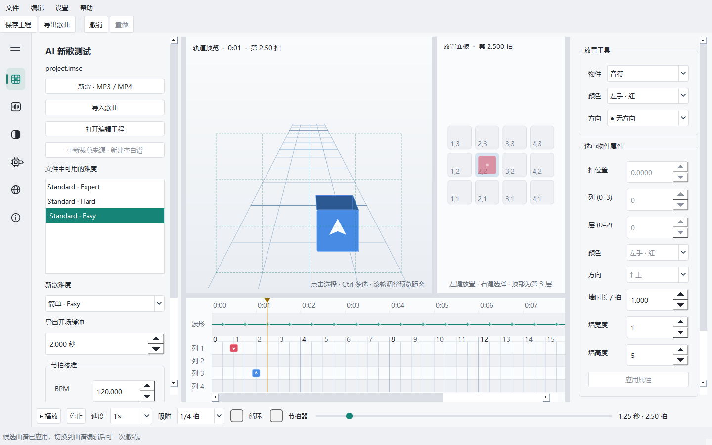
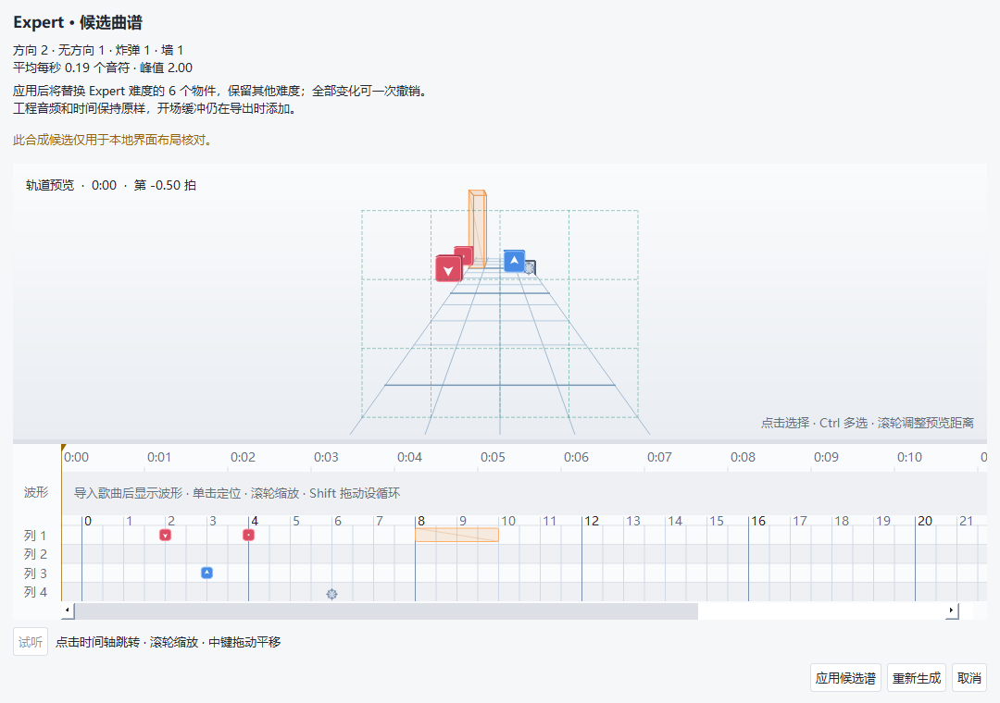
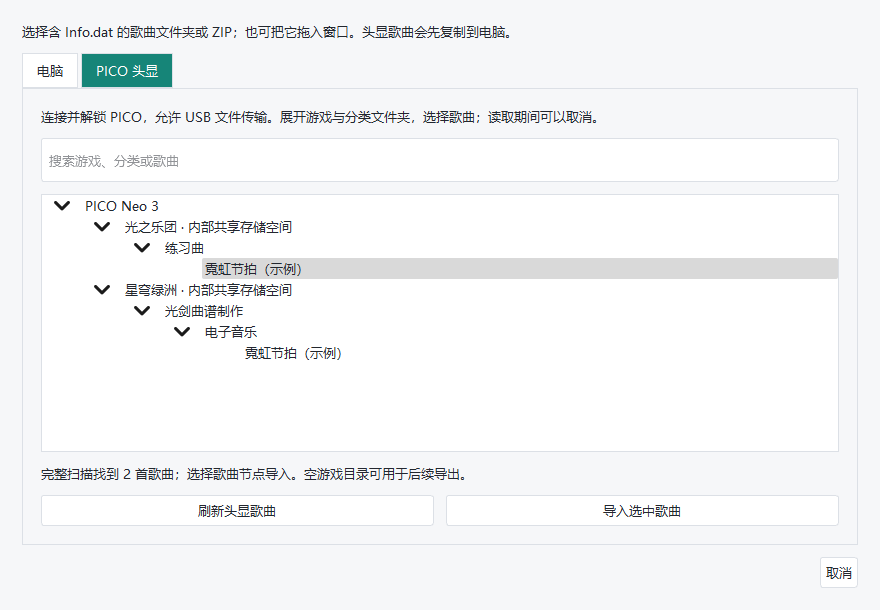
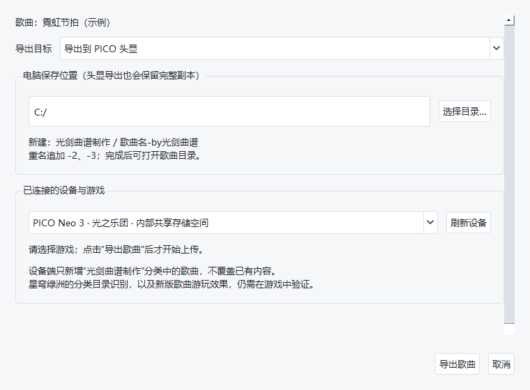

# 光剑曲谱制作

基于 **Qt5 / C++** 的 Windows 曲谱编辑器，支持手动编排、MP3/MP4 音频处理和 AI 整曲制谱。用户已反馈此前导出歌曲可用于 PICO Neo 3 的《星穹绿洲》和《光之乐团》。APK 留在后续阶段。

**v0.5.0** 默认使用本地快速制谱：无需模型连接、Python 或独立显卡，使用音乐起音、动作模式和有限搜索生成候选谱，并增加上下层、内外列及斜切变化；原有大语言模型方式仍可选择。新增确认后删除头显歌曲，并修复新版灯光和静态配色物件导致的编辑锁定，具体验证范围见 [更新记录](CHANGELOG.md)。

当前源码开发版默认“AI 建议 + 本地编排”：模型给出整曲编排建议，本地使用六种动作族与乐句变奏生成初稿，再按需精修重点段落或所选片段。未配置模型时使用本地规划；“本地快速制谱”（纯本地）仍可离线运行。候选谱和本软件新建工程都支持精修前后对比、有限节奏调整和一次撤销。上述新增能力不改变已发布的 v0.5.0 下载包，手感仍需头显试玩。

## 下载与快速开始

**[下载 v0.5.0 Windows 便携版](https://github.com/Vae-x/Lightsaber-Musical-Score-Creation/releases/tag/v0.5.0)** · [全部版本](https://github.com/Vae-x/Lightsaber-Musical-Score-Creation/releases)

下载 ZIP 后完整解压，在 Windows 64 位电脑运行 `LightsaberMusicalScoreCreation.exe`。保留同目录 DLL、插件和 `tools/`；基础编辑、音频处理和本地快速制谱无需安装 Qt、Python 或 FFmpeg，可离线使用。选择大语言模型制谱时，使用自己的 API 服务或本机 Codex / ChatGPT 账号授权，需要网络；账号方式还需安装官方 Codex CLI。

1. 点击“导入歌曲”，选择电脑中的歌曲文件夹或 ZIP，或在 PICO 页按游戏和分类查找歌曲；新建歌曲使用“新歌 · MP3 / MP4”。
2. 选择难度，在轨道和 4×3 面板编辑；新歌也可使用“AI 分析与制谱”生成候选谱，试听后应用。
3. “保存工程”用于继续编辑，默认放在 `projects/<歌名>/project.lmsc`。工程与旁边的 `assets-*`、`source-*` 和恢复快照一起保留。
4. “导出歌曲”生成可复制、可传输的完整歌曲。电脑输出为 `所选目录/光剑曲谱制作/歌曲名-by光剑曲谱/`，重名自动追加编号；完成后可直接打开目录。连接 PICO 后也可选择目标游戏直接上传新增歌曲。

`assets-*` 是工程的原始资源快照，正式导出会合并编辑结果；手动复制请使用导出完成窗口提供的歌曲目录。

## 软件截图

以下为真实软件界面，使用合成歌曲和模拟设备目录；不包含用户曲目、账号或密钥。

### 曲谱编辑

### AI 分析与制谱

### PICO 分类导入

### 歌曲导出

## 功能与兼容范围

- **歌曲与音频**：自动识别目录或 BeatSaver ZIP；MP3/MP4 可选音轨、裁剪、转换 Ogg，自动估算 BPM 和第一拍，支持手动校准。
- **手动编辑**：五种通用难度标识，普通红蓝方块、方向、炸弹、墙；多选、复制粘贴、镜像、撤销重做、慢速试听、循环、节拍器与节拍吸附。
- **AI 制谱**：源码开发版默认 AI 整曲建议后本地生成，六种动作族随短乐句发展；可纯本地运行，也保留原模型逐段制谱。初稿与 AI 精修候选可对比试听、恢复和继续，精修允许有限的真实起音节奏调整。确认后仅修改所选难度，保留其他难度并支持一次撤销。原音频不上传，模型请求可能产生服务费用。
- **设备导入与管理**：PICO 歌曲按“设备 → 游戏 → 分类 → 歌曲”展开，可搜索，导入只读复制到电脑；可选择单首歌曲，核对完整位置并确认后删除其设备目录，不删除分类或游戏根。
- **设备导出**：先完整导出到电脑，再选择《星穹绿洲》或《光之乐团》上传到其 `光剑曲谱制作` 分类目录。只新增、不覆盖或删除；上传逐文件回读校验，取消或失败保留电脑副本并提示可能残留目录。
- **工程与保护**：工程独立保存、恢复快照；已有歌曲的其他难度、原音频、未知 JSON 和高级数据保留。编辑器书签布尔设置及新版普通灯光不再误判为变速；基础物件静态颜色随编辑保留，真正无法解释的时间或关联内容仍保护，并显示具体原因。
- **导出开场缓冲**：新歌默认 2 秒，可设 0～10 秒，音频只补一次静音并同步后移全部难度的基础物件，工程编辑时间不变。已有导入歌曲不自动添加缓冲。
- **外观与连接**：浅色、深色、跟随系统，可折叠导航；多个 API 提供商、自定义兼容接口、Codex 授权、代理和中文关于/GPL 查看。密钥由 Windows DPAPI 保护，不进入工程或歌曲包。

PICO 使用既有歌曲根目录：

| 游戏 | 内部共享存储空间中的歌曲根目录 |
| --- | --- |
| 星穹绿洲 | `SoulTopia/BeatNote/Custom` |
| 光之乐团 | `Android/data/com.StarRiverVR.LightBand/files/CustomMusic` |

两处直接导出都在根目录下使用 `光剑曲谱制作/歌曲名-by光剑曲谱/`。光之乐团分类使用来源于用户反馈；**星穹绿洲分类识别没有可靠公开说明，仍待游戏内验证**。电脑校验、MTP 传输和实际游玩分别记录。开场缓冲效果、游戏难度映射及 Windows 10 兼容仍需独立实测。高级灯光、弧线/链条及模组效果目前侧重保存和保护，尚无完整预览。

v0.5.0 已在 Windows 11 与真实 PICO Neo 3 上完成两游戏的 USB 分类扫描、合成歌曲上传回读校验、导入编辑、删除确认取消与实际删除；原歌曲保留。Debug、Release 各 21 项 CTest 通过。**此次未验收游戏内分类识别、声音、方块显示或新谱手感**，Windows 10 仍待实测，详细范围见 [更新记录](CHANGELOG.md)。

### 与 Steam《Beat Saber》的关系

曲目使用同类 JSON 元数据、难度谱面和音频结构。Beat Saber PC 版支持自定义歌曲，社区曲目通常从 BeatSaver 下载后放入 `Beat Saber_Data/CustomLevels`；Steam 页面未列出创意工坊支持。不同谱面版本和模组依赖不能保证互通，本编辑器目前编辑基础 v2/v3，其他数据按保护规则保留。[格式说明](https://bsmg.wiki/mapping/map-format.html)、[曲目安装说明](https://bsmg.wiki/pc-modding.html)、[Steam 页面](https://store.steampowered.com/app/620980/Beat_Saber/)

操作与排查见 [使用说明](docs/使用说明.md)，AI 行为见 [AI 设置与自动制谱方案](docs/AI设置与自动制谱方案.md)，每轮验证范围见 [更新记录](CHANGELOG.md)。

## 开发与许可

源码按 `src/app/`（入口）、`src/core/`（曲谱与服务）、`src/gui/`（Qt 窗口与控件）分工。同类 `.h/.cpp` 和窗口 `.ui` 放在一起；目录、工具链和构建方法见 [工程目录说明](docs/工程目录说明.md)。

根 `CMakeLists.txt` 为推荐入口，`src/CMakeLists.txt` 继续兼容已有 CLion 工程。采用 Qt 5.12.12 / MinGW 7.3 的 32 位应用工具链；FFmpeg 和 WPD 传输工具为 64 位，因此发行包面向 Windows 64 位。音频依赖用 `scripts/setup-audio-tools.ps1` 准备；设备 helper 通过 Windows .NET Framework C# 编译器构建，源代码在仓库中。新构建集中于 `build/debug/`、`build/release/`，便携包用 `scripts/package-portable.ps1` 创建。

本地歌曲、编辑工程、设备元数据、构建与便携包均不提交；`samples/beatmaps/`、`projects/` 只跟踪 `.gitkeep`，依赖二进制留在忽略目录。持续协作与中文提交推送规则见 [AGENTS.md](AGENTS.md)。

采用 **GNU GPL v3**：[完整许可](LICENSE)。Qt、FFmpeg 及其他依赖保留各自原许可证和来源说明，项目协议不替换第三方条款。[音频工具来源与许可](third_party/ffmpeg/README.md)
