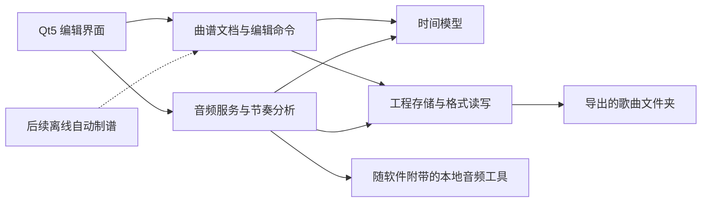

# 首版需求与架构

整理日期：2026-10-01。用户已整体确认框架并授权实施；首版业务闭环与本轮 0.2.0 桌面新增功能均已完成验证，具体记录分节列出。本文保留需求与验收基准，并区分模块测试、桌面集成与尚未完成的头显游玩/Windows 10 实测。

本文以用户亲自确认的选择和当前代码事实为依据；实现能力与待完成的验收分别记录。

## 1. 产品目标与交付顺序

软件的中文名称为 **光剑曲谱制作**，当前仓库/检出目录标识仍为 `Lightsaber Musical Score Creation`。使用 **Qt5 / C++** 开发 Windows 桌面软件，先满足用户自己使用，支持离线、解压即用，使用者无需安装 Python 或自行配置转换工具。

首个游戏验收目标是 **PICO Neo 3 独立运行的《星穹绿洲》**。编辑器运行在电脑上，导出到电脑后，由用户手动复制到头显：

```text
此电脑\Pico Neo 3\内部共享存储空间\SoulTopia\BeatNote\Custom
```

首版完成手动制谱闭环：既能修改现有曲谱，也能从 MP3/MP4 创建新谱。后续离线自动制谱以生成结果基本能直接游玩为目标，音乐情绪参与段落编排。《光之乐团》的验证和 APK 版本在后续阶段考虑。

## 2. 用户已确认的需求

| 范围 | 已确认的行为 |
| --- | --- |
| 已有曲谱 | 导入已有歌曲/曲谱，试听、手动编辑、导出；保留未编辑内容及高级数据 |
| 新歌 | 导入 MP3 或 MP4，自动处理音频，创建空白谱，手动编排后导出 |
| MP4 | 只使用声音；有多条音轨时选择需要的一条 |
| 裁剪 | 支持选择歌曲片段，默认整首；裁剪后的起点作为新谱的时间起点 |
| 对拍 | 自动估算 BPM 和第一拍位置，并允许手动校准 |
| 界面 | 3D 轨道预览、4×3 放块面板、音频波形时间轴 |
| 编辑对象 | 普通红蓝方块、切割方向、炸弹、普通墙 |
| 操作 | 放置、删除、移动、改方向、多选、复制粘贴、左右镜像、撤销重做 |
| 试听辅助 | 正常/慢速播放、时间轴定位、选区循环、节拍器、节拍吸附 |
| 工程 | 独立编辑工程，支持自动保存、恢复和继续编辑，再导出歌曲文件夹 |
| 难度 | 用户确认游戏共有四档；**新歌首版只制作其中一个难度** |
| 高级内容 | 弧线、链条、灯光和模组数据保留；可能破坏关联的物件或操作受保护，显示原因 |
| 设备传输 | 从电脑或 PICO 只读导入歌曲；导出到电脑，由用户手动复制进头显 |

导入已有多难度歌曲时，选择其中一张谱编辑，其他难度、玩法和原始标识保留。当前新建使用基础 v2.2 谱面和普通双手玩法 Standard，只创建一张 Expert 文件标识的难度；该标识参考用户已确认可玩的 Dry Hands。

四档难度的准确显示名称和文件标识映射尚未核实。实现时按游戏实机核验结果确定；不能将通用格式中的难度枚举直接视为这款游戏的界面规则。

## 3. 两条使用流程

### 从新歌开始

```text
选择 MP3/MP4
  → 检查音轨；必要时选择音轨
  → 选择并预听裁剪片段
  → 离线转换音频、建立编辑工程
  → 估算 BPM/第一拍、手动校准
  → 设置歌名、封面和一个难度
  → 手动编排、试听和调整
  → 校验并导出歌曲文件夹
  → 手动复制到头显，在《星穹绿洲》中游玩验收
```

### 修改已有谱

```text
选择电脑歌曲文件夹、PICO 头显歌曲或 BeatSaver ZIP
  → 头显来源先只读复制到电脑缓存
  → 导入到独立工程，保存原始文件快照
  → 识别 Info 和各难度的格式，选择一张谱
  → 查看保护范围，编辑允许修改的基础物件
  → 试听、撤销/重做、保存工程
  → 合并实际改动，校验并导出完整歌曲文件夹
  → 手动复制到头显验收
```

## 4. 界面安排

- 左侧：工程、歌曲信息、难度选择。
- 中央：3D 轨道与 4×3 放置面板，显示基础物件和选择状态。
- 底部：波形、拍线、播放头、缩放、吸附精度、循环选区和播放控制。
- 右侧：当前物件的时间、位置、颜色、方向等属性；受保护物件显示原因。
- 后台任务区：导入、转换、波形分析、估拍和导出的进度、取消及错误信息。

3D、时间轴与声音共用音频播放时间基准。首版预览以基础物件和编辑辅助为范围；保存高级数据与完整模拟高级效果分别记录能力和验证状态。当前轨道视图绘制普通方块、炸弹和墙；弧线、链条、灯光与模组内容保留并保护关联基础物件，暂不提供专属绘制或高级效果模拟。

## 5. 模块与源码位置

继续使用现有 `src/app/`、`src/core/`、`src/gui/`。同一类的 `.h/.cpp` 放一起，窗口的 `.ui` 放在窗口类旁边。当前已创建 `BeatmapDocument`、`TimeMap`、`ProjectStore`、`AudioService`、`RhythmAnalyzer`、`MtpImportService`、`WorkspacePaths` 和 `EditorViews`；首版将格式读写和编辑命令实现于 `BeatmapDocument`，下表中的后续拆分类名仍是架构边界建议。

| 计划模块 | 建议位置/类名 | 职责 |
| --- | --- | --- |
| 启动与组装 | `src/app/main.cpp`、后续 `AppController.h/.cpp` | 组装文档、音频、窗口和后台任务，管理应用状态 |
| 曲谱文档 | `src/core/BeatmapDocument.h/.cpp` | 保存原始 JSON/资源，建立基础物件可编辑视图与内部标识 |
| 格式读写 | `src/core/BeatmapCodec.h/.cpp` | 分别识别 Info/难度格式，读取 v2/v3、合并修改、校验导出 |
| 时间模型 | `src/core/TimeMap.h/.cpp` | 秒与拍数转换、分段 BPM、校准、吸附和播放定位 |
| 编辑命令 | `src/core/EditCommand.h/.cpp` | 所有编辑操作、保护检查、撤销重做；批量操作使用同一规则 |
| 工程存储 | `src/core/ProjectStore.h/.cpp` | 工程资产、原始快照、保存、自动保存、恢复和独立导出 |
| 音频服务 | `src/core/AudioService.h/.cpp` | 音轨探测、裁剪转码、流式 PCM 试听、波形缓存和取消 |
| 节奏分析 | `src/core/RhythmAnalyzer.h/.cpp` | 自动估拍、结果可信程度和人工校准数据 |
| 头显导入 | `src/core/MtpImportService.h/.cpp`、`scripts/windows/mtp-import.ps1` | 后台只读枚举 MTP 歌曲，复制并校验本地缓存，不写入设备 |
| 工程位置 | `src/core/WorkspacePaths.h/.cpp` | 源码根/便携根 `projects/`、同名目录编号、无写权限时的文档目录回退 |
| 编辑界面 | `src/gui/MainWindow.h/.cpp/.ui`、后续独立控件 | 放置面板、属性、波形/时间轴和 3D 视图 |
| 后续生成接口 | 后续 `src/core/` 下的生成任务接口 | 接入离线自动制谱引擎，生成结果通过编辑命令进入工程 |

核心模块避免依赖窗口控件。界面调用核心服务；启动层组装模块。转换和耗时分析不在界面线程中执行。



`resources/` 放图标、样式、翻译和资源清单；`third_party/` 记录选用依赖的版本、源码获取方式和许可证；`scripts/` 放部署脚本；`tests/` 放小型自建数据和必要测试。本地曲谱及核验副本继续排除在 Git 外。

0.2.0 追加已获用户授权的整理：中文名称及用户图标、Windows 版本资源、只读 MTP 头显导入、默认 `projects/` 工程位置、中文关于/GPL v3 查看与仓库文档。新增业务已完成独立模块、主窗口实机和便携集成验证，记录在第 8.2 节。

## 6. 工程建议与处理规则

以下为已随整体框架获得用户确认的工程默认值；具体实现与验证状态见第 8 节。

### 媒体与时间

- 用应用附带的 FFmpeg/ffprobe 完成本地音轨探测、提取与转码。MP4 无音轨时明确报告；多音轨时让用户选择。
- 新歌采用 Ogg/Vorbis 作为首个待实测输出方案；文件名、Info 引用与实际编码一致。具体参数通过《星穹绿洲》实测确定。
- 工程保留来源与裁剪记录、重新裁剪需要的原媒体资产，以及当前编辑音频。导入不覆盖用户的原 MP3/MP4；“重新裁剪来源 · 新建空白谱”读取该来源和音轨范围，创建另一张空白新谱，已有音符不自动迁移。
- 首版裁剪用于新歌导入。编辑已有谱时保留原音频，避免重新压缩或整体移动原有高级数据。
- 试听、波形与估拍使用分块读取或磁盘缓存的 PCM，不把整个视频或整首高采样率音频一次加载进内存。
- 慢速试听默认保持音高；波形、3D 和循环范围随同一播放时钟同步。
- 自动估测及 BPM/第一拍校准用于新歌。当前界面不允许手动改已有谱的 BPM、音频偏移和变速数据；可识别的变速用分段时间模型处理。已有谱的独立试听校准属于后续扩展边界，不应误解为当前已可修改这些节拍参数。
- 未知时间扩展保留并报告。若无法可靠解释秒拍映射，限制受影响的编辑或将该谱设为只读，显示原因；不按猜测的时间写回物件。

### 数据保护与保存

- 原始 JSON 与可编辑视图并存，仅将实际编辑的字段合并回原格式。未编辑难度、未知字段、附件和高级数组保留。
- 关联弧线/链条的音符、模组特效物件、异常坐标和无法可靠解释的对象进入保护状态。选择或操作时说明原因。
- 移动、删除、改色、改方向、镜像、复制粘贴和批量命令都在核心层检查保护范围，包含粘贴到高级端点的冲突；不静默执行部分操作。
- 工程自包含必要媒体、原始快照和编辑状态，可移动目录后继续打开。默认建议 `projects/<歌名>/project.lmsc`，同名目录使用编号；应用目录无写权限时回退到用户文档中的 `光剑曲谱制作/工程/`。工程入口也可自由命名为 `.lmsc`，旁边的 `assets-*`、`source-*` 和恢复用 `autosave.lmsc` 应一起保留。首次保存后每 30 秒自动保存改动快照；工程清单采用原子写入。
- 导出写入独立输出目录。导出检查 JSON、资源引用、保护内容是否发生改变以及未编辑数据是否保留，暂存完整目录后原子提交。保存和导出过程中等待完成，音频转换任务可以取消。
- 已有可玩谱中的 `.egg/.ogg` 引用差异作为兼容情况处理：检查实际文件和唯一匹配候选，保留原始信息；导入时不擅自重命名或转码。新歌输出方案单独实测。
- ZIP 导入在独立目录中进行，并校验条目路径，防止写出工程目录。
- MTP 设备歌曲通过“导入歌曲文件夹”的“PICO 头显”页读取。先只读复制到电脑会话缓存，检查文件数量、大小与 Info 资源引用后再交给文档模块；设备原文件保持不变，导出不直接写回设备。

### 当前开发环境

当前机器是 Windows 11 64 位，已有 Qt 5.12.12 / MinGW 7.3 的 32 位应用工具链。首版沿用该环境，以流式媒体处理和独立任务避免大内存占用。已准备固定 BtbN FFmpeg `n9.0.2-17-g2a571b6068-20260930` Windows x86_64 LGPL shared 工具，下载 SHA256 与发布清单核对一致，已实测包含 libvorbis 编码器。版本、来源和 LGPL v3 许可见 [音频工具说明](../third_party/ffmpeg/README.md)。

首个验收环境使用这台电脑和用户的 Neo 3；Windows 10/11 发行兼容另做验证。当前 32 位 Qt 应用通过独立进程调用 64 位音频工具，因此这套便携包要求 Windows 64 位。使用者不需要联网、Python 或自行安装转换工具。公开发行前仍需整理所有启用依赖的对应许可证和源码提供材料。具体编码参数和游戏兼容性需要实机结果确认。

## 7. 已核实事实与证据范围

| 事项 | 证据与限制 |
| --- | --- |
| 实际设备目录 | 已只读找到指定 Custom 目录，包含 19 个歌曲文件夹；有些目录名带 `.zip`，MTP 属性仍为文件夹 |
| 可玩基准 | 用户确认 Dry Hands 在头显中能游玩且有声音；Info 为 2.0，谱为 2.2，Standard/Expert 是文件中的标识 |
| 音频差异 | Dry Hands 与 Monodrama 实际音频为 `.ogg`，Info 引用 `.egg`；变化来源未确定，不推断为游戏自动改名 |
| 另一份样本 | Monodrama Info 2.1，抽查谱 3.3，包含弧线；文件存在不能证明所有高级效果均可运行 |
| 本地旧样本 | 10 ZIP、20 张难度，含 v2/v3、真实变速、弧链、灯光与重模组数据；没有 v4 样本 |
| 星穹绿洲 | 官方商店包名 `com.SoulTime.SoulTopia`，开发商 SoulTime Studio，支持 Neo3；官方隐私政策确认 UGC 谱面导入 |
| 游戏公开版本 | 商店列出星穹绿洲 0.2.2（2024-11-20）；这是公开页面值，设备实际安装版本未读取 |
| 兼容范围 | 未找到星穹绿洲官方格式支持矩阵；具体格式、物件、变速与特效支持必须分别验证 |

核验时复制的五个小型元数据/配置文件归档在 `build/archive/build-device-inspect/pico-json/`，已被 Git 忽略。头显文件未改动。游戏成绩和收藏配置与谱面资源分别识别，导出新谱时不套用旧成绩。

## 8. 实施顺序与首版验收

1. **数据闭环**：导入基础谱、建立原始快照和可编辑模型；原样导出及单物件修改导出均验证数据保留。
2. **编辑工程**：工程保存/恢复、基础命令、撤销重做、保护规则；接入放置面板和属性。
3. **音频与新歌**：MP3/MP4 探测、选择音轨、裁剪转换、空白单难度谱、波形、自动估拍与人工校准。
4. **完整工作台**：音频同步的 3D/时间轴、慢速、循环、节拍器、吸附、多选、复制粘贴与镜像。
5. **便携交付和实机验收**：依赖部署、离线启动、导出校验，用户复制进星穹绿洲游玩。

首版完成标准：

- Dry Hands 导入、少量基础修改、导出后在头显中正常识别、有声音并能游玩。
- MP3 与 MP4 分别经过选段、自动转换、对拍、空白单谱编排和导出，再在头显中验证。
- 自动估拍失败或结果不准时仍可手动完成对齐。
- 受保护数据在批量操作、撤销重做和保存后保持；未编辑难度、音频和附件保持。
- 保存工程后能重新打开；异常退出的自动保存可恢复。
- 变速时间换算和音频定位经独立数据验证；重样本加载与时间窗渲染经性能验证。
- 离线且不要求使用者安装开发环境；Windows 10/11 兼容性按实际测试记录。

### 8.1 此前首版的验证记录

以下记录对应本轮整理前的首版；本轮新增业务单独记录在下一节。

| 范围 | 当前状态 | 验证边界 |
| --- | --- | --- |
| 曲谱文档、时间模型、保护与编辑命令 | 已实现，核心测试通过 | 本地 10 ZIP、20 张难度原样导出逐文件 SHA256 一致；真实 Dry Hands 方向修改仅对应一个字段变化，撤销后谱文件恢复原字节；未知数据保留、整批保护检查已验证 |
| 工程存储与导出 | 已实现，存储测试通过 | 工程保存/重新打开、自动恢复、恶意 ZIP 路径、资源保留和原子保护测试通过；原媒体、音轨/裁剪记录随工程保留，游戏导出使用当前转换音频 |
| 音频与节奏分析 | 源码与工具已落盘，独立模块测试通过 | 自制 MP3/双音轨 MP4 的探测、选轨、裁剪、Vorbis、PCM、波形、慢放、循环、暂停、定位、取消与错误处理已运行；自制 120 BPM 样本估为 120.000 BPM、第一拍 0.245 秒、可信度 0.712 |
| 基础轨道、网格与时间轴视图 | 已实现，已有谱工作台验证通过 | `MainWindowTest` 使用真实鼠标与快捷键验证放置、选择、属性、删除、Ctrl+Z/Y、难度切换、含保护物件的整批拒绝和轨道 framebuffer 色块绘制 |
| 构建、正式测试与便携运行 | Windows 11 本机通过 | Qt 5.12.12 Debug/Release 编译和五项 CTest 全部通过；系统纯 PATH 下实际 GUI 导入、音频、编辑、撤销/重做、保存、导出、重新打开通过 |
| 新歌对话框与保存/导出 | 实际界面流程通过 | MP3 与双音轨 MP4 通过真实文件选择、裁剪对话框、MP4 第二音轨 absoluteIndex=2、1～4 秒转换、单难度空谱与自动估拍；预听解码忙时立即点转换也完成。保存/导出/重开后 importSource 音轨/裁剪与原媒体 SHA256 一致，源媒体快照未进入导出 |
| 游戏与发行兼容 | 待验证 | 编辑器导出的修改谱/新歌尚未在 Neo 3 验收，Windows 10 兼容和高级效果支持尚未证明 |

当前估拍最多分析音频前 180 秒，只提供建议；节奏弱、变速或半速/倍速歧义时仍需手动设置 BPM 和第一拍。PCM 与慢放缓存保留在临时磁盘目录，慢放缓存最多三份，切换歌曲清理旧缓存。

此前首版于 2026-10-01 运行的正式 CTest 五项全部通过：`core_editing`、`core_samples`、`audio_fixtures`、`audio_service`、`main_window_editor`。这些证据覆盖该版的本机桌面实现；头显游玩和 Windows 10 验收仍分别待实测。

操作流程见 [使用说明](使用说明.md)。最终导出在电脑进行，由用户手动复制到头显指定 Custom 文件夹后戴头显确认；开发过程不向头显写文件。格式校验不能替代实机游玩。

此前首版便携目录为 `dist/Lightsaber Musical Score Creation-20261001-155550/`，对应 ZIP `dist/Lightsaber-Musical-Score-Creation-Windows-20261001.zip` 为 90,200,972 字节，约 86 MiB；该目录经系统纯 PATH 运行验证，ZIP 内资产与目录 SHA256 一致。它是本机历史交付，不作为本轮新增功能的测试证据。

### 8.2 本轮 0.2.0 实施与验证记录

| 范围 | 当前状态 | 验证证据 |
| --- | --- | --- |
| 中文名称、用户图标与版本资源 | 已接入，构建与界面检查通过 | PNG/ICO 透明度与尺寸核验；界面名称/图标测试通过；EXE ProductName、FileDescription 中文且版本为 0.2.0 |
| MTP 只读导入 | 模块与主窗口实机流程通过 | 9 项离线断言、4 项实机断言；当前 Neo 3 列出 19 首歌曲，Dry Hands 5 文件、828,055 字节复制校验通过；32 位 Qt 调用 64 位 Shell 与真实头显导入对话框测试通过 |
| 默认工程目录、关于与 GPL 查看 | 已实现，正式测试通过 | `workspace_paths` 通过；界面品牌/图标/关于/GPL 全文用例通过，GPL v3 标准全文保存在根 `LICENSE` |
| 构建输出归档 | 已完成，新 Debug/Release 构建通过 | 7 个旧构建目录原生移到 `build/archive/`，无覆盖；CLion 缓存留原位；新构建在 `build/debug/`、`build/release/` |
| 中文资料与协作 | 文档、协议和规则已完成，GitHub 简介已中文 | 本地工程、设备与二进制输出忽略规则核验通过；原三条提交说明已改为中文并保留本机历史备份，后续遵循验证后提交与推送约定 |
| 正式测试与便携部署 | 本机 Windows 11 通过 | 七项 CTest 7/7；界面更新后相关 2/2 再测通过；QtTest 10/10；纯系统 PATH 便携编辑闭环与 133 个清单文件 SHA256 核验通过 |

完整 CTest 为 `core_editing`、`mtp_import_service`、`workspace_paths`、`core_samples`、`audio_fixtures`、`audio_service`、`main_window_editor`。新增实机界面用例和样式修复后，相关界面/媒体测试再次 2/2 通过；界面 QtTest 10/10 含 Neo 3 导入对话框与许可查看。

最终便携目录为 `dist/光剑曲谱制作-20261001-171545/`，ZIP 交付名为 `dist/光剑曲谱制作-Windows-v0.2.0-20261001.zip`。目录在纯系统 PATH 下通过实际 Dry Hands 导入、音频、编辑、撤销/重做、保存、导出、重新打开与渲染；133 个清单文件 SHA256 核验通过。构建产物、设备缓存和包文件均只留在本机。

上述 MTP 实测证明设备读取与电脑复制闭环，不证明编辑器导出后的歌曲已在游戏游玩。头显游玩与 Windows 10 兼容仍待独立验收。

## 9. 后续阶段

自动制谱独立于首版手动编辑闭环。预留后台任务接口，支持进度、取消、失败恢复；生成结果进入同一编辑文档和命令系统。后续评估节奏分析、动作规则、情绪/段落控制和可用模型，验收目标是基本能直接游玩。具体模型和生成质量需实际评估后决定。

光之乐团的格式/导入差异及 APK 的触屏界面、部署环境在后续阶段明确。核心数据和编辑规则与窗口分离，为后续复用保留边界。

## 10. 参考主源

- [星穹绿洲 PICO 官方商店](https://store.picoxr.com/cn/detail/1/7341376834514321443)
- [星穹绿洲官方隐私政策](https://bwevrrotdam.feishu.cn/wiki/GfTCwNiCSiHlIVkscxdcrHEZnLf?from=from_copylink)
- [光之乐团 PICO 官方商店](https://store.picoxr.com/cn/detail/1/7104569862109790213)
- [FFmpeg 音轨选择](https://ffmpeg.org/ffmpeg.html#Stream-selection)、[ffprobe](https://ffmpeg.org/ffprobe.html)、[Vorbis 编码](https://ffmpeg.org/ffmpeg-codecs.html#libvorbis)、[许可说明](https://ffmpeg.org/legal.html)
- [Xiph Ogg](https://xiph.org/ogg/)
- [Qt 5.12 Windows 多媒体](https://doc.qt.io/archives/qt-5.12/qtmultimedia-windows.html)
- [BSMG 谱面格式、弧线、链条及 BPM](https://bsmg.wiki/mapping/map-format/beatmap.html)

这些主源说明对应软件或数据格式的事实；模块划分、保护策略和工程默认值已随本框架获得用户整体确认，当前实现与验收证据分别记录。
